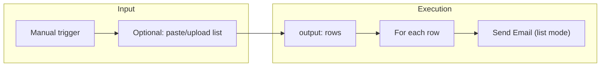

# Non-technical user UX improvements

## Current gaps (from codebase)

- **Email node** ([components/nodes/action-email-node.tsx](components/nodes/action-email-node.tsx)): single "To" field only; no list/CSV or "send to many" flow.
- **HTTP node** ([components/nodes/action-http-node.tsx](components/nodes/action-http-node.tsx)): raw method (GET/POST/…) + URL + body; assumes user knows APIs.
- **API discovery** ([lib/api-discovery.ts](lib/api-discovery.ts), [lib/api-catalog.ts](lib/api-catalog.ts)): fixed catalog (Gmail, SendGrid, Slack, Custom HTTP); no OpenAPI or user-provided specs.
- **Add-node** ([components/add-node-dropdown.tsx](components/add-node-dropdown.tsx)): technical labels ("HTTP", "Email", "Trigger"); no plain-language descriptions or onboarding.
- **Import** ([components/import-dialog.tsx](components/import-dialog.tsx)): workflow JSON only; no CSV/Excel for data.
- **Execution** ([lib/workflow-store.ts](lib/workflow-store.ts), [lib/compute-stubs.ts](lib/compute-stubs.ts)): single run from trigger; no "run for each row" or list input.

---

## 1. Bulk data and list-friendly flows

**Goal:** Support "list of recipients" (or any tabular data) so users can paste a list, upload CSV/Excel, or use data from a previous step, and run actions (e.g. email) once per row.

- **Data source options**
  - **Option A (recommended):** Add a **"Data" / "List"** input concept:
    - New node type (e.g. `data-list`) or extend **Manual trigger** to accept optional "Input data": paste (one value per line or CSV), or upload CSV/Excel.
    - Store parsed rows (array of objects) as the trigger output; downstream nodes can reference `{{row.email}}`, `{{row.name}}`, etc.
  - **Option B:** Allow "Upload CSV" or "Paste list" only at **Run time** (e.g. when user clicks Run on the manual trigger): same parsed rows flow through the graph as context.
- **Email (and similar) nodes**
  - Extend [lib/node-types.ts](lib/node-types.ts) `actionEmailDataSchema`: add `toSource: "single" | "list"` and `toListField` (e.g. `email` column name) when `toSource === "list"`.
  - In [components/nodes/action-email-node.tsx](components/nodes/action-email-node.tsx): when "list", show "Column for email address" (dropdown or text) instead of single "To" input; optionally "Subject/Body from column" for per-row customization.
  - In [lib/compute-actions.ts](lib/compute-actions.ts) `computeActionEmail`: if upstream output is an array of rows, **loop** and send one email per row (using mapped columns); otherwise keep current single-email behavior.
- **Execution model**
  - In [lib/workflow-store.ts](lib/workflow-store.ts) run logic: when trigger outputs an array, downstream nodes that support "per row" (e.g. email with `toSource: "list"`) receive each row in turn (or the full array and iterate internally in compute). Define a simple contract: e.g. trigger can set `output` to `{ rows: [...] }` and action nodes interpret that when configured for list mode.
- **Import data (no new node type if using Option B)**
  - In [components/import-dialog.tsx](components/import-dialog.tsx) (or a new "Import data" entry point): allow uploading/pasting CSV (and optionally Excel). Store as a "dataset" in workflow or global store; manual trigger can offer "Use dataset: X" at run time so the run has rows without adding a new node type.

**Deliverables:** Schema and UI for list/single on email (and optionally Slack); run-time or node-level list input (paste/upload CSV); executor support for per-row execution where applicable.

---

## 2. OpenAPI-driven API discovery (hide HTTP details)

**Goal:** Let users point to an OpenAPI spec (file upload or URL); AI/engine picks the right endpoint and method so users describe intent (e.g. "Create a contact in CRM") instead of choosing GET/POST and URLs.

- **OpenAPI ingestion**
  - New module e.g. [lib/openapi-ingest.ts](lib/openapi-ingest.ts): parse OpenAPI 3.x (JSON/YAML); normalize to operations with: `method`, `path`, `summary`/`operationId`, `parameters`, `requestBody`. Map to existing catalog shape ([lib/api-catalog.ts](lib/api-catalog.ts)): add `CatalogService`/`CatalogOperation` from spec (e.g. one service per tag or per spec file).
  - Store ingested specs in workflow store or a dedicated store (e.g. by workflow or global "My APIs") so the catalog can merge built-in + dynamic operations.
- **UI for adding an API**
  - In sidebar or Connections: "Add API" → "Upload openapi.json" or "Enter spec URL". On success, refresh catalog and show "API [name] added; you can say e.g. 'Create contact' in your workflow description."
  - Optional: list "Your APIs" and allow remove/refresh.
- **Discovery and HTTP node**
  - Extend [lib/api-discovery.ts](lib/api-discovery.ts): when matching steps to operations, search both built-in catalog and OpenAPI-sourced operations (by `summary`, `operationId`, or intent keywords).
  - [lib/workflow-generator.ts](lib/workflow-generator.ts): when generating an `action-http` node from a discovered OpenAPI operation, prefill `method`, `url` (resolved with base URL), and parameter mapping.
  - **HTTP node UX** ([components/nodes/action-http-node.tsx](components/nodes/action-http-node.tsx)):
    - If the node is tied to a catalog/OpenAPI operation: show **"Action"** dropdown (friendly name) and a **simple form** for required/optional parameters (from spec); hide raw method/URL/body or show in "Advanced".
    - If "Custom request" or no operation: keep current method + URL + body UI for power users.

**Deliverables:** OpenAPI ingest + merge into catalog; "Add API" (upload/URL) in UI; discovery and generator using dynamic ops; HTTP node with "action + parameters" mode when operation is known.

---

## 3. Plain-language UI and onboarding

**Goal:** Reduce jargon and make the first experience clear for someone who does not know "trigger", "webhook", or "HTTP".

- **Add-node dropdown** ([components/add-node-dropdown.tsx](components/add-node-dropdown.tsx))
  - Keep groups (Triggers, Actions, Control flow, Data & AI) but use **friendlier labels and short descriptions**:
    - e.g. "Send an email", "Post to Slack", "Call an API or service", "Run on a schedule", "Wait for approval", "If/else branch", "Delay (wait X time)".
  - Optional: tooltip or subtitle under each item (e.g. "Run the workflow by hand" for Manual trigger).
- **Requirement chat** ([components/requirement-chat.tsx](components/requirement-chat.tsx))
  - Add 2–3 **example prompts** or "I want to…" chips above or below the input (e.g. "Send a welcome email to new signups", "Notify my team in Slack when a form is submitted", "Run a report every Monday and email it").
  - Placeholder: e.g. "Describe what you want to automate, e.g. 'Send an email to everyone on my list'."
- **First-time / onboarding**
  - Optional: on first load or first empty workflow, show a short **welcome** (e.g. sheet or banner): "Start by describing your workflow in the sidebar with **Create with AI**, or add steps with **Add node**." Link to "Create with AI" and "Add node".
- **Node titles**
  - [components/nodes/generic-business-node.tsx](components/nodes/generic-business-node.tsx) and HTTP node: when node is bound to an OpenAPI/catalog operation, show the **operation name** (e.g. "Create contact") in the card title instead of "HTTP Request" where possible.

**Deliverables:** Updated add-node labels/descriptions; requirement chat examples and placeholder; optional first-time hint; HTTP/action node title from operation name when available.

---

## 4. Icons throughout the UI

**Goal:** Use icons consistently across the app so actions and concepts are easier to scan and understand for non-technical users.

- **Where to add icons**
  - **Sidebar** ([components/app-sidebar.tsx](components/app-sidebar.tsx)): Already uses Remix icons (e.g. RiChatSmile3Line, RiAddLine, RiKeyLine, RiLinkM). Ensure every menu item has an icon; add icons for "New Workflow", "Import", "Import data" (when added), and workflow list items if desired (e.g. generic workflow icon).
  - **Add-node dropdown** ([components/add-node-dropdown.tsx](components/add-node-dropdown.tsx)): Already has icons per node type. Keep them; ensure new or renamed items (e.g. "Send an email", "Call an API") use a matching icon.
  - **Node cards**: Use a small icon next to the node title in [components/node-card.tsx](components/node-card.tsx) or per-node (e.g. [components/nodes/action-email-node.tsx](components/nodes/action-email-node.tsx), [components/nodes/action-http-node.tsx](components/nodes/action-http-node.tsx)) so each node type is visually distinct at a glance.
  - **Requirement chat** ([components/requirement-chat.tsx](components/requirement-chat.tsx)): Icon for "Create with AI" / sheet title; icons for example prompt chips (e.g. mail, slack, calendar); send button already has RiSendPlaneLine.
  - **Panels / toolbar** ([components/panels.tsx](components/panels.tsx)): Run, Stop, Edit, Approve, Export, etc. — ensure every button has an icon (many already do via Remix icons).
  - **Dialogs**: Import, Connections, API Keys, Add API (OpenAPI), "Import data" — use a clear icon in dialog headers or primary actions.
  - **Form fields**: Where it helps, add inline icons (e.g. mail icon next to "To", link icon next to URL, calendar next to schedule) in action-email-node, action-http-node, trigger-schedule, etc.
- **Consistency**
  - Stick to one icon set (the app already uses [Remix Icon](https://remixicon.com) via `@remixicon/react`). Use the same icon for the same concept everywhere (e.g. email = RiMailLine, link/API = RiLinkM).
- **Accessibility**
  - Icons should sit alongside text for primary actions (not replace it) so screen readers and clarity are preserved; decorative icons in node titles or list items are fine as-is.

**Deliverables:** Icons on every sidebar and dialog action; optional icon in node card headers per type; icons for requirement chat examples and key form labels; consistent use of Remix Icon across the app.

---

## 5. Other UX details

- **Import**
  - Keep "Import Workflow" (JSON). Add **"Import data"** (or "Upload list") for CSV/Excel to create a dataset used by manual trigger or list-based steps (ties into section 1).
- **Run with input**
  - When the user runs a workflow that starts with manual trigger and list-capable steps: optional **"Provide input"** (paste list/CSV or select an imported dataset) so one run processes many rows (section 1).
- **Templates** ([lib/templates.ts](lib/templates.ts))
  - Add a **one-line plain-language description** per template (e.g. "Onboard new hires: welcome email, Slack, then approval"). Surface in sidebar or template picker so users choose by goal, not by name only.
- **Connections / API keys**
  - In [components/app-sidebar.tsx](components/app-sidebar.tsx), "Connections" and "API Keys": add one short sentence each (e.g. "Connect Gmail, Slack, and other services so workflows can send email or post messages.") to reduce confusion for non-technical users.

---

## Implementation order (suggested)

1. **Icons throughout the UI** (section 4) — quick win; add icons to sidebar, node cards, dialogs, and requirement chat so the app feels clearer and more polished.
2. **Plain-language UI and onboarding** (section 3) — low risk, immediate clarity.
3. **OpenAPI ingest + catalog + HTTP "action" UX** (section 2) — high impact for "I want to call an API" without knowing HTTP.
4. **Bulk data: run-time input + email "list" mode** (section 1) — paste/upload CSV at run, email node "send to column", executor per-row.
5. **Data node / Import data and templates descriptions** (sections 1 and 5) — then optional list node or dataset picker and template descriptions.

---

## Architecture note (list execution)

- Trigger output can be `{ rows: [ { email, name, ... }, ... ] }`.
- Downstream nodes that support "list" (e.g. email) either receive the full `rows` and iterate in compute, or the runner invokes the node once per row with a single-row context; both are valid; choose one and stick to it for consistency.

