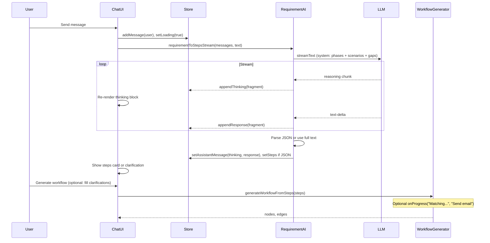

# Sophisticated Workflow AI: Thinking, Scenarios, and User Input

## Current state

- **Requirement AI** ([lib/requirement-ai.ts](lib/requirement-ai.ts)): Single `generateText` call. System prompt asks for either JSON steps or 1–2 clarification questions. No streaming, no visible reasoning.
- **Chat UI** ([components/requirement-chat.tsx](components/requirement-chat.tsx)): Renders `messages` and a "Steps I'll create" card; assistant content is the raw LLM output (JSON or text). No thinking block.
- **Generation** ([lib/workflow-generator.ts](lib/workflow-generator.ts), [lib/api-discovery.ts](lib/api-discovery.ts)): `generateWorkflowFromSteps` runs `discoverOperations` (per-step, with optional AI for HTTP) then builds nodes/edges. No progress or narrative shown to the user.
- **Existing pattern**: [components/nodes/ai-node.tsx](components/nodes/ai-node.tsx) already uses `streamText` with `fullStream`, handles `chunk.type === "reasoning"`, and surfaces reasoning in a child markdown node. Same SDK pattern can be reused for the requirement chat.

---

## 1. Show AI thinking in the chat

**Goal:** Stream the model’s reasoning into the chat and show it in a dedicated, refined block (e.g. collapsible “Thinking” section) so the user sees how the AI is reasoning before the final reply.

**Approach:**

- **Requirement store** ([lib/requirement-store.ts](lib/requirement-store.ts)): Extend message shape to support optional `thinking?: string` on assistant messages (or a separate “thinking” message type). Add a way to append streaming thinking and then set the final content (e.g. `addThinkingFragment`, `setAssistantContent`), or keep a single “pending” assistant message that is updated as chunks arrive.
- **Requirement AI** ([lib/requirement-ai.ts](lib/requirement-ai.ts)):
  - Switch from `generateText` to `streamText` with `fullStream`.
  - Use the same provider options as the AI node where applicable (e.g. Google `thinkingConfig`, Anthropic `thinking`, xAI `reasoningEffort`) so reasoning chunks are emitted when the provider supports them.
  - Consume the stream: on `reasoning` chunks, append to a thinking buffer; on `text-delta`, append to the response buffer. When the stream finishes, parse the final text for JSON steps or treat as plain-text reply.
  - **Fallback for providers/models without native reasoning:** In the system prompt, ask for a structured format, e.g. `THINKING:\n...\n\nRESPONSE:\n...` (or `<thinking>...</thinking><response>...</response>`), and parse it. Then show the THINKING part in the thinking block and the RESPONSE part as the main message. This keeps “thinking” visible for all models.
- **Requirement chat UI** ([components/requirement-chat.tsx](components/requirement-chat.tsx)):
  - For each assistant message that has `thinking`, render a **Thinking** block above the main content: muted styling, monospace or serif for a “reasoning” feel, optionally using [components/ui/collapsible.tsx](components/ui/collapsible.tsx) so it’s “Thinking (expand)” by default or expanded with a max height and scroll.
  - Support streaming: if the store exposes a “pending” thinking + response, update the UI on each fragment so the user sees thinking and then the reply appear in real time.
  - Keep existing behavior: final message is either parsed steps (show “Steps I’ll create” card) or plain text (clarification/questions).

**Files:** [lib/requirement-store.ts](lib/requirement-store.ts), [lib/requirement-ai.ts](lib/requirement-ai.ts), [components/requirement-chat.tsx](components/requirement-chat.tsx).

---

## 2. Sophisticated, multi-phase thinking process

**Goal:** Make the AI’s reasoning process explicit and structured (understand → scenarios → gaps → decide), so the thinking block reads as a clear, refined process rather than a single blob.

**Approach:**

- **System prompt** in [lib/requirement-ai.ts](lib/requirement-ai.ts): Rewrite to define clear phases the model should follow (and, when using the THINKING/RESPONSE fallback, to output in that order):
  1. **Understand:** Restate the user’s goal and key entities (who, what, when, which systems).
  2. **Scenarios:** Consider the happy path, then failure/alternatives (e.g. approval rejected, timeout, API error, missing data), retries, and branches (if X then A else B).
  3. **Gaps:** Identify ambiguities or missing inputs (recipients, channels, timeouts, retry count, approval timeout).
  4. **Decide:** Either ask 1–2 short, actionable clarification questions (plain-text RESPONSE) or decompose into steps (JSON RESPONSE). If asking questions, phrase them so the user can answer briefly; offer to use placeholders if they prefer.
- Keep the same **output contract**: either a single JSON object `{"steps":[...]}` (and optionally `"clarifications":[...]`) or plain text for questions. No change to the step schema used by [lib/workflow-generator.ts](lib/workflow-generator.ts).

**Files:** [lib/requirement-ai.ts](lib/requirement-ai.ts).

---

## 3. Cover every possible scenario and ask for input when needed

**Goal:** The AI should explicitly consider multiple scenarios (happy path, failures, timeouts, branches) and either add the right steps or ask the user for inputs when something is ambiguous.

**Approach:**

- **Prompt instructions:** In the same system prompt, add explicit rules:
  - “Consider: happy path; what happens on failure (approval rejected, API error); timeouts and delays; missing or invalid data; retries; alternative branches. Include condition, approval, or delay steps where they matter.”
  - “If critical details are missing (e.g. who receives the email, which Slack channel, approval timeout), ask 1–2 brief questions before generating steps, unless the user said to use placeholders.”
- **Optional structured clarifications:** Extend the JSON shape to `{"steps":[...], "clarifications": [{"stepId": "1", "question": "Who should receive the welcome email?", "placeholder": "new hire email"}]}`. If present, the chat UI can show these as optional fields or tooltips near “Generate workflow” (e.g. “Optional: set recipient” with a small input). This is optional; the current multi-turn Q&A already “takes input when needed.”
- **Validation pass (optional, later):** After decomposition, a second lightweight call could validate: “Given these steps, list any missing scenarios (e.g. no step for ‘if approval rejected’).” and then either suggest extra steps or one more question to the user. Can be a follow-up iteration.

**Files:** [lib/requirement-ai.ts](lib/requirement-ai.ts), [components/requirement-chat.tsx](components/requirement-chat.tsx) (only if you add UI for `clarifications`).

---

## 4. Optional: Show progress during “Generate workflow”

**Goal:** When the user clicks “Generate workflow”, make the process feel transparent (e.g. “Discovering operations… Matching ‘Send email’ to Gmail… Building graph…”).

**Approach:**

- **Option A – Progress callback:** Extend `generateWorkflowFromSteps` (or `discoverOperations`) to accept an optional `onProgress?: (phase: string, detail?: string) => void`. Call it at key points (e.g. “Discovering operations”, “Matching step 1: Send email”, “Building workflow”). The sidebar passes a callback that appends a “system” or “progress” message to the chat, or shows a small progress strip above the canvas.
- **Option B – Narrative AI:** Before or after generation, one short AI call that summarizes what was done (“I created a 5-step workflow: manual trigger → send email via Gmail → add to Slack → 24h delay → reminder email.”) and show that as an assistant message. Simpler but less “live” than Option A.

**Files:** [lib/workflow-generator.ts](lib/workflow-generator.ts), [lib/api-discovery.ts](lib/api-discovery.ts), [components/app-sidebar.tsx](components/app-sidebar.tsx) and/or [components/requirement-chat.tsx](components/requirement-chat.tsx).

---

## Data flow (high level)

---

## Implementation order

1. **Store + streaming + thinking UI** – Extend store for thinking/streaming, switch requirement-ai to `streamText`, surface reasoning (and THINKING/RESPONSE fallback) in the chat with a dedicated Thinking block.
2. **Prompt upgrade** – Multi-phase (understand → scenarios → gaps → decide) and scenario coverage; optional `clarifications` in JSON.
3. **Clarifications UI** (optional) – If `clarifications` is present, show optional inputs before or next to “Generate workflow”.
4. **Generation progress** (optional) – Add `onProgress` to `generateWorkflowFromSteps` and show progress in the chat or a strip.

---

## Summary

| Area                 | Change                                                                                                                                                                                                     |
| -------------------- | ---------------------------------------------------------------------------------------------------------------------------------------------------------------------------------------------------------- |
| **Thinking in chat** | Stream reasoning into the store; show a refined, optionally collapsible “Thinking” block above each assistant reply; fallback to THINKING/RESPONSE format when the provider doesn’t emit reasoning chunks. |
| **Thinking process** | System prompt reframed into phases: understand → scenarios → gaps → decide; same output contract (JSON steps or plain-text questions).                                                                     |
| **Scenarios**        | Prompt explicitly requires considering happy path, failures, timeouts, retries, branches; suggest condition/approval/delay steps where relevant.                                                           |
| **User input**       | Keep multi-turn Q&A; make questions actionable; optionally add `clarifications` in JSON and simple UI for optional inputs before generate.                                                                 |
| **Generation**       | Optional progress callback or short narrative so the user sees what’s happening when they click “Generate workflow”.                                                                                       |

