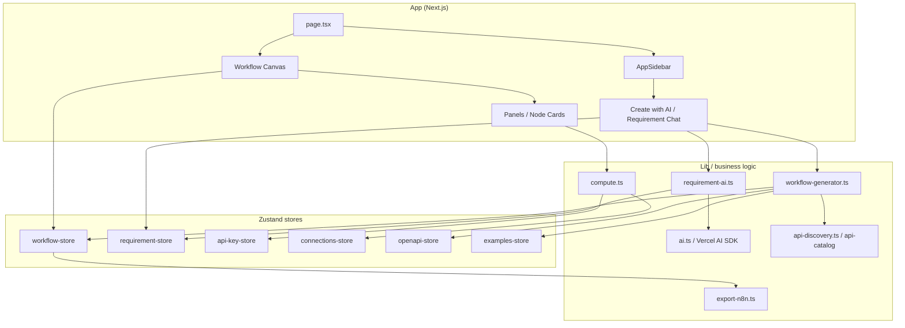
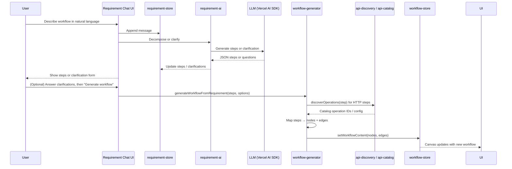
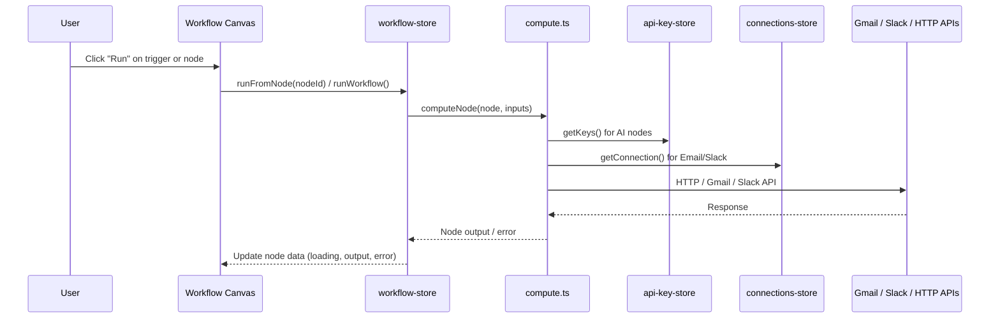
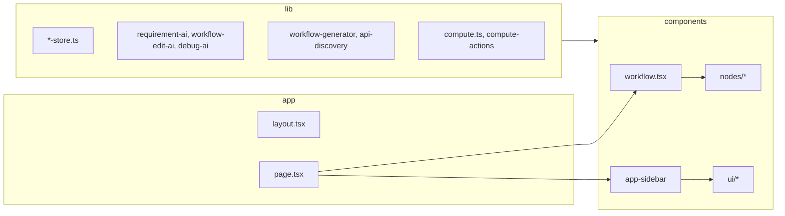

# Architecture

This document describes the high-level architecture of **One for All** and how its main pieces fit together.

---

## High-level system architecture

- **UI**: Next.js App Router, single main page with sidebar + React Flow canvas. “Create with AI” lives in the sidebar; the canvas shows nodes and edges.
- **State**: All persistent and runtime state is in Zustand stores (workflows, requirement chat, API keys, connections, OpenAPI catalog, examples).
- **Logic**: AI (Vercel AI SDK), requirement decomposition (`requirement-ai`), workflow generation (`workflow-generator`), API discovery/catalog, node execution (`compute`), and n8n export.

---

## Data flow: AI-driven workflow creation

1. User describes the process in the requirement chat.
2. `requirement-ai` calls the LLM to decompose into steps (or ask 1–2 clarifications).
3. Steps (and optional clarification answers) are stored in `requirement-store`.
4. On “Generate workflow”, `workflow-generator` turns steps into nodes/edges, uses `api-discovery` / `api-catalog` for HTTP steps, then writes to `workflow-store`.
5. The canvas (bound to `workflow-store`) shows the new workflow.

---

## Data flow: Run workflow (execute nodes)

- Execution is triggered from the UI; `workflow-store` drives run (e.g. `runFromNode` / `runWorkflow`).
- `compute.ts` runs each node type (AI, HTTP, email, Slack, delay, condition, approval, etc.), using `api-key-store` and `connections-store` for secrets.
- Results and errors are written back into workflow state so the canvas and panels can show output and “Debug with AI” can use them.

---

## Project structure (key areas)

| Path | Purpose |
|------|--------|
| `app/` | Next.js App Router: `layout`, `page` (loads sidebar + workflow canvas). |
| `components/` | `workflow.tsx` (React Flow + node types), `app-sidebar.tsx`, `requirement-chat`, `panels`, `nodes/*` (per-type UI), `ui/*` (shadcn). |
| `lib/` | Zustand stores (`workflow-store`, `requirement-store`, `api-key-store`, `connections-store`, `openapi-store`, `examples-store`), AI modules (`requirement-ai`, `workflow-edit-ai`, `debug-ai`), workflow generation (`workflow-generator`, `api-discovery`, `api-catalog`), execution (`compute`, `compute-actions`), export (`export-n8n`). |
| `hooks/` | Shared hooks (e.g. `use-mobile`). |
| `fixtures/` | Sample OpenAPI spec for tests/demos. |
| `public/` | Static assets (e.g. logo). |

---

## Component → store usage

| Component / feature | Primary store(s) | Other lib deps |
|--------------------|------------------|----------------|
| Workflow canvas | `workflow-store` | `compute`, node types |
| Create with AI / requirement chat | `requirement-store` | `requirement-ai`, `workflow-generator` |
| API Keys panel | `api-key-store` | — |
| Connections (Gmail, Slack) | `connections-store` | — |
| Endpoints / OpenAPI | `openapi-store` | `openapi-ingest`, `api-discovery` |
| Edit in NL / Debug with AI | `workflow-store` | `workflow-edit-ai`, `debug-ai` |
| Export to n8n | `workflow-store` | `export-n8n` |

---

## Summary

- **Single-page app**: sidebar + React Flow canvas; all workflow and AI flows stay in the client.
- **State**: Zustand stores hold workflows, requirement conversation, API keys, connections, OpenAPI catalog, and examples.
- **AI**: Vercel AI SDK for LLM calls; `requirement-ai` for decomposition/clarification; `workflow-generator` for steps → graph; `workflow-edit-ai` and `debug-ai` for edits and debugging.
- **Execution**: `compute` runs nodes using keys and connections; results flow back into `workflow-store` and the UI.

For more on usage and setup, see the [README](../README.md).
